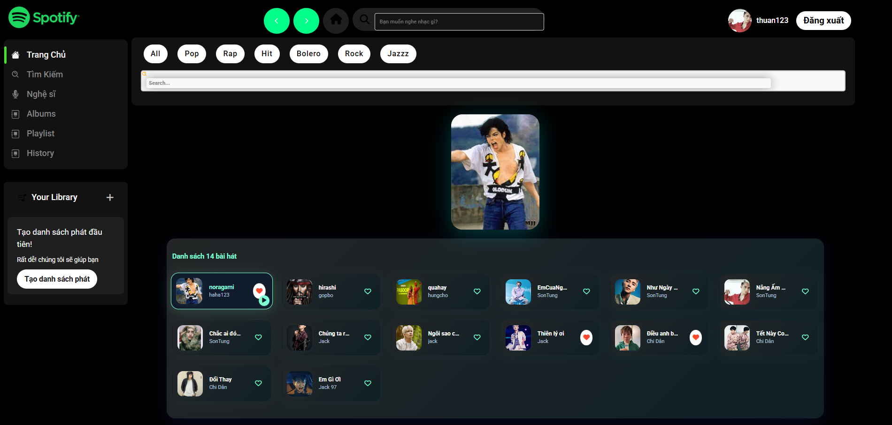
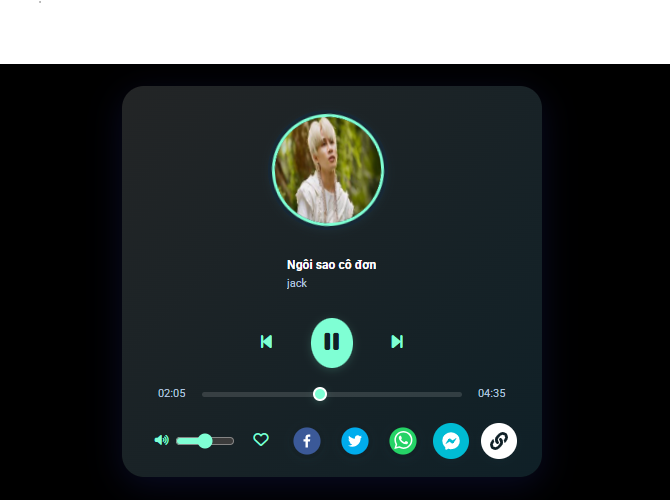
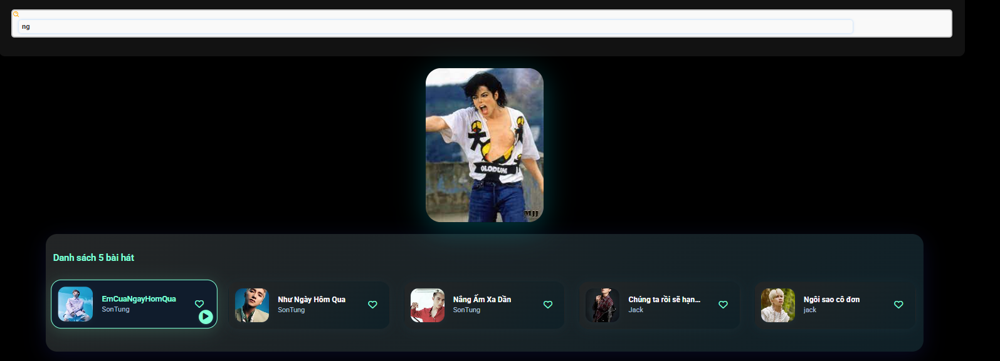
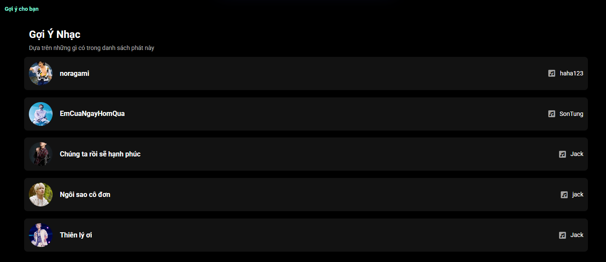
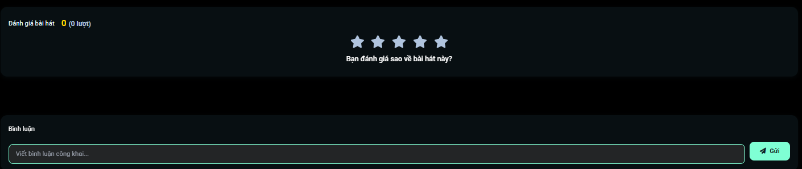
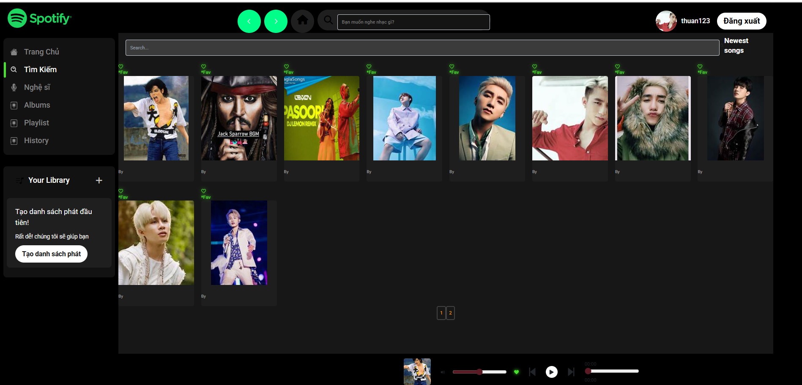
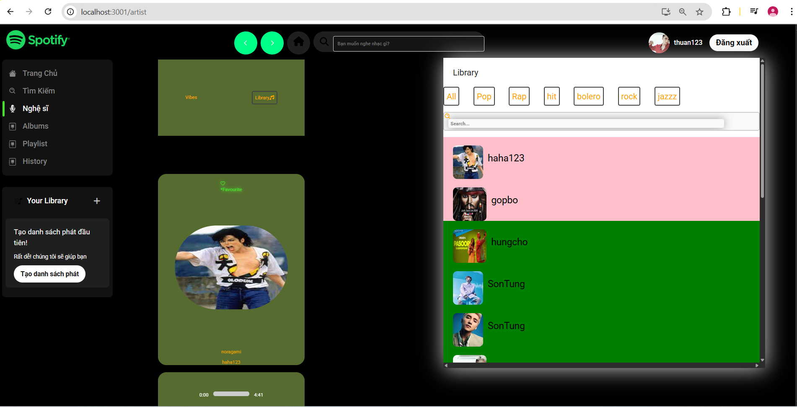
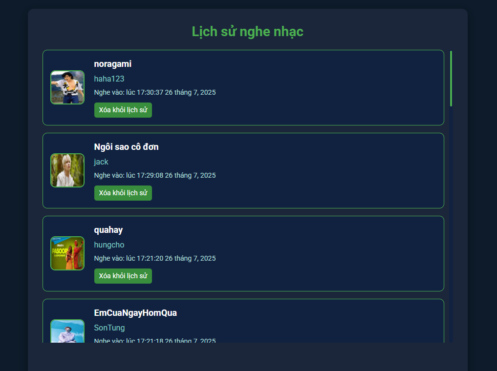
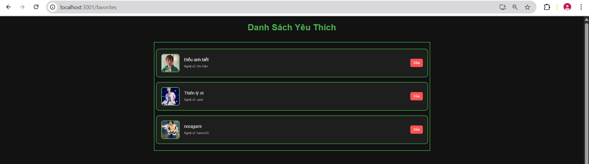

# 🎵 Vibes Music - Modern Music Streaming App

<div align="center">
  
  
  
  
</div>

<div align="center">
  <h3>🎧 Ứng dụng nghe nhạc hiện đại với giao diện đẹp mắt và tính năng đầy đủ</h3>
</div>

---

## 📸 Demo Screenshots

### 🏠 Trang chủ


_Giao diện trang chủ với trending songs và playlists nổi bật_

### 🎵 Music Player


_Player hiện đại với full controls và waveform_

### 🔍 Tìm kiếm


_Tính năng tìm kiếm thông minh với live results_

---

## ✨ Tính năng chính

### 🎶 **Music Features**

- ▶️ Phát nhạc với chất lượng cao
- 🔀 Shuffle và repeat modes
- 📊 Waveform visualization
- 🎚️ Volume control với mute
- ⏭️ Next/Previous track controls
- 📱 Keyboard shortcuts support

### 🎨 **UI/UX Features**

- 🌙 Dark theme hiện đại
- 🎭 Glassmorphism effects
- ✨ Smooth animations
- 📱 Fully responsive design
- 🖱️ Hover effects và transitions
- 🎯 Intuitive navigation

### 🔍 **Discovery Features**

- 🔥 Trending songs
- 🕒 Recently played
- 📋 Featured playlists
- 🔍 Advanced search
- 🎵 Song recommendations
- 👤 Artist profiles

### 👤 **User Features**

- 🔐 User authentication
- ❤️ Favorite songs
- 📚 Personal library
- 📋 Custom playlists
- 📊 Listening history
- 👥 Social features

---

## 🛠️ Tech Stack

### **Frontend**

- ⚛️ **React 18** - UI Library
- 🎨 **CSS3** - Styling với CSS Variables
- 🔄 **React Router** - Navigation
- 🗃️ **Redux** - State Management
- 📱 **Responsive Design** - Mobile-first approach

### **Backend**

- 🟢 **Node.js** - Runtime Environment
- 🚀 **Express.js** - Web Framework
- 🍃 **MongoDB** - Database
- 🔐 **JWT** - Authentication
- 📁 **Multer** - File Upload
- 🔒 **bcrypt** - Password Hashing

### **Tools & Libraries**

- 🎵 **Web Audio API** - Audio Processing
- 📦 **Mongoose** - MongoDB ODM
- 🌐 **Axios** - HTTP Client
- 🎨 **Font Awesome** - Icons
- 📸 **React Image Gallery** - Image Handling

---

## 🚀 Hướng dẫn cài đặt

### 📋 Yêu cầu hệ thống

- 🟢 **Node.js** >= 16.0.0
- 🍃 **MongoDB** >= 5.0.0
- 📦 **npm** hoặc **yarn**
- 💾 **Git**

### 1️⃣ Clone Repository

```bash
git clone https://github.com/yourusername/vibes-music-app.git
cd vibes-music-app
```

### 2️⃣ Cài đặt Backend

```bash
# Di chuyển vào thư mục API
cd api

# Cài đặt dependencies
npm install

# Tạo file .env
cp .env.example .env
```

### 3️⃣ Cấu hình Environment Variables

Tạo file `.env` trong thư mục `api/`:

```env
# Database
MONGODB_URI=mongodb://localhost:27017/vibes_music
DB_NAME=vibes_music

# JWT
JWT_SECRET=your_super_secret_jwt_key_here
JWT_EXPIRES_IN=7d

# Server
PORT=4000
NODE_ENV=development

# File Upload
UPLOAD_PATH=./uploads
MAX_FILE_SIZE=10485760

# CORS
FRONTEND_URL=http://localhost:3000
```

### 4️⃣ Khởi động MongoDB

```bash
# Trên Windows
net start MongoDB

# Trên macOS/Linux
sudo systemctl start mongod
# hoặc
brew services start mongodb-community
```

### 5️⃣ Khởi động Backend Server

```bash
# Trong thư mục api/
npm run dev

# Server sẽ chạy tại http://localhost:4000
```

### 6️⃣ Cài đặt Frontend

```bash
# Mở terminal mới, di chuyển vào thư mục front
cd front

# Cài đặt dependencies
npm install
```

### 7️⃣ Khởi động Frontend

```bash
# Trong thư mục front/
npm start

# App sẽ chạy tại http://localhost:3000
```

---

## 🎯 Hướng dẫn sử dụng

### 🎵 **Upload nhạc**

1. Đăng nhập vào admin panel
2. Chọn "Upload Song"
3. Điền thông tin bài hát
4. Upload file audio (.mp3, .wav)
5. Upload ảnh cover
6. Lưu và publish

### 🎧 **Nghe nhạc**

1. Browse songs trên homepage
2. Click vào bài hát để phát
3. Sử dụng player controls:
   - ⏯️ Play/Pause: `Spacebar`
   - ⏭️ Next: `→`
   - ⏮️ Previous: `←`
   - 🔊 Volume: `↑/↓`

### 📋 **Tạo Playlist**

1. Vào "Library" → "Create Playlist"
2. Đặt tên và mô tả
3. Add songs từ library
4. Share với bạn bè

### 🔍 **Tìm kiếm**

1. Sử dụng search bar ở top
2. Tìm theo tên bài hát, nghệ sĩ, album
3. Filter kết quả theo category
4. Save searches yêu thích

---

## 📁 Cấu trúc Project

```
vibes-music-app/
├── 📁 api/                    # Backend Server
│   ├── 📁 controllers/        # Route Controllers
│   ├── 📁 models/            # Database Models
│   ├── 📁 routes/            # API Routes
│   ├── 📁 middleware/        # Custom Middleware
│   ├── 📁 uploads/           # Uploaded Files
│   ├── 📁 utils/             # Utility Functions
│   ├── 📄 server.js          # Main Server File
│   └── 📄 .env               # Environment Variables
│
├── 📁 front/                 # Frontend React App
│   ├── 📁 public/            # Static Files
│   ├── 📁 src/               # Source Code
│   │   ├── 📁 components/    # React Components
│   │   │   ├── 📁 Layout/    # Layout Components
│   │   │   ├── 📁 Music/     # Music Components
│   │   │   └── 📁 Player/    # Player Components
│   │   ├── 📁 pages/         # Page Components
│   │   ├── 📁 hooks/         # Custom Hooks
│   │   ├── 📁 utils/         # Utility Functions
│   │   ├── 📁 store/         # Redux Store
│   │   └── 📄 App.js         # Main App Component
│   └── 📄 package.json       # Dependencies
│
├── 📁 screenshots/           # Demo Screenshots
├── 📄 README.md             # Documentation
└── 📄 .gitignore            # Git Ignore Rules
```

---

## 🔧 Scripts có sẵn

### **Backend Scripts**

```bash
npm start          # Khởi động production server
npm run dev        # Khởi động development server với nodemon
npm run test       # Chạy tests
npm run lint       # Kiểm tra code style
```

### **Frontend Scripts**

```bash
npm start          # Khởi động development server
npm run build      # Build production
npm run test       # Chạy tests
npm run eject      # Eject từ Create React App
```

---

## 🌐 API Endpoints

### **Authentication**

```http
POST   /api/auth/register     # Đăng ký user mới
POST   /api/auth/login        # Đăng nhập
POST   /api/auth/logout       # Đăng xuất
GET    /api/auth/me           # Lấy thông tin user
```

### **Songs**

```http
GET    /api/songs             # Lấy danh sách bài hát
GET    /api/songs/:id         # Lấy chi tiết bài hát
POST   /api/songs             # Upload bài hát mới
PUT    /api/songs/:id         # Cập nhật bài hát
DELETE /api/songs/:id         # Xóa bài hát
```

### **Playlists**

```http
GET    /api/playlists         # Lấy danh sách playlist
POST   /api/playlists         # Tạo playlist mới
PUT    /api/playlists/:id     # Cập nhật playlist
DELETE /api/playlists/:id     # Xóa playlist
```

### **Search**

```http
GET    /api/search?q=query    # Tìm kiếm bài hát
GET    /api/search/suggestions # Gợi ý tìm kiếm
```

---

## 🎨 Customization

### **Thay đổi Theme Colors**

Chỉnh sửa CSS variables trong `front/src/App.css`:

```css
:root {
  --primary-color: #1db954; /* Màu chính */
  --secondary-color: #191414; /* Màu phụ */
  --background-color: #121212; /* Màu nền */
  --text-primary: #ffffff; /* Màu chữ chính */
  --text-secondary: #b3b3b3; /* Màu chữ phụ */
}
```

### **Thêm Audio Effects**

```javascript
// Trong MusicPlayer component
const audioContext = new AudioContext();
const gainNode = audioContext.createGain();
const analyser = audioContext.createAnalyser();

// Thêm reverb, equalizer, etc.
```

---

## 🚀 Deployment

### **Frontend (Netlify/Vercel)**

```bash
# Build production
cd front
npm run build

# Deploy folder 'build' lên hosting
```

### **Backend (Heroku/Railway)**

```bash
# Tạo Procfile
echo "web: node server.js" > Procfile

# Set environment variables trên hosting platform
# Deploy code lên platform
```

### **Database (MongoDB Atlas)**

1. Tạo cluster trên MongoDB Atlas
2. Lấy connection string
3. Cập nhật `MONGODB_URI` trong .env

---

## 🤝 Contributing

### **Quy trình Contribute**

1. 🍴 Fork repository
2. 🌿 Tạo feature branch: `git checkout -b feature/amazing-feature`
3. 💾 Commit changes: `git commit -m 'Add amazing feature'`
4. 📤 Push to branch: `git push origin feature/amazing-feature`
5. 🔄 Tạo Pull Request

### **Code Style Guidelines**

- ✅ Sử dụng ES6+ syntax
- ✅ Follow React best practices
- ✅ Write meaningful commit messages
- ✅ Add comments cho complex logic
- ✅ Test trước khi commit

---

## 🐛 Troubleshooting

### **Lỗi thường gặp**

#### **MongoDB Connection Error**

```bash
# Kiểm tra MongoDB service
sudo systemctl status mongod

# Restart MongoDB
sudo systemctl restart mongod
```

#### **Port đã được sử dụng**

```bash
# Tìm process đang dùng port
lsof -i :3000
lsof -i :4000

# Kill process
kill -9 <PID>
```

#### **CORS Error**

Kiểm tra `FRONTEND_URL` trong file `.env` của backend

#### **File Upload Error**

Kiểm tra quyền write cho thư mục `uploads/`

```bash
chmod 755 api/uploads
```

---

---

## 📄 License

Dự án này được phân phối dưới **MIT License**. Xem file [LICENSE](LICENSE) để biết thêm chi tiết.

---

## 🙏 Acknowledgments

- 🎵 **Spotify** - UI/UX inspiration
- 🎨 **Apple Music** - Design patterns
- 📚 **React Community** - Amazing ecosystem
- 🎧 **Web Audio API** - Powerful audio processing
- 💚 **Open Source Community** - Endless support

---

### 🏠 Một số giao diện khác








### và một số pages khác ...

---

<div align="center">
  <h3>⭐ Nếu project hữu ích, hãy cho một star nhé! ⭐</h3>
  
  **Made with ❤️ by [Your Name]**
  
  
  
</div>
